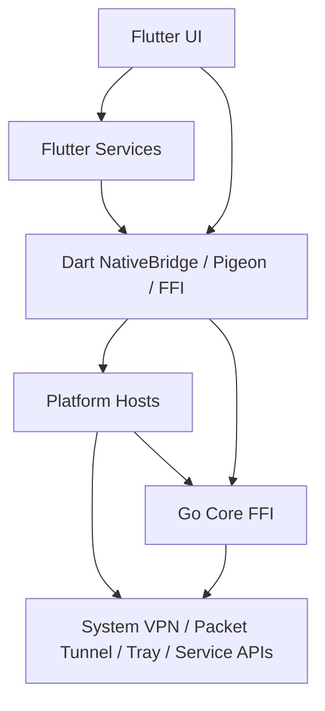

# 工程实现参考总索引

本目录补齐 Xstream 当前仓库的工程实现参考，目标是把“设计 → 模块 → 文件 → 类/函数/接口”串起来，作为开发、重构、排障和 AI 辅助编码时的第一入口。

## 系统设计概览

Xstream 当前实现由 5 个层次构成：

1. Flutter 壳层与界面：`lib/main.dart`、`lib/screens/*`、`lib/widgets/*`、本地化与主题。
2. Flutter 运行时服务：`lib/services/*`、`lib/utils/global_config.dart`、模板、日志和配置生成。
3. Flutter 桥接层：`lib/utils/native_bridge.dart`、`lib/bindings/bridge_bindings.dart`、`lib/xray_ffi.dart`。
4. Go Core FFI：`go_core/*.go`，对外导出 Xray、节点服务、桌面集成和运行时快照能力。
5. 原生宿主层：Darwin Host API、Apple Runner/PacketTunnel、Android、Linux、Windows 宿主代码。

## 模块分层与主调用链

主链路按职责可以再拆成两条：

- 界面与业务链：页面 -> `GlobalState` / `VpnConfig` / `SessionManager` / `DesktopSyncService`。
- 隧道与宿主链：Flutter -> `NativeBridge` / Pigeon / FFI -> Darwin/Android/Desktop Host -> Go Core / Packet Tunnel。

## 阅读顺序

| 顺序 | 文档 | 适用场景 |
| --- | --- | --- |
| 1 | `docs/engineering/flutter-shell-ui.md` | 先理解入口、导航、页面与组件边界。 |
| 2 | `docs/engineering/flutter-runtime-services.md` | 理解节点、会话、同步、DNS、模板和全局状态。 |
| 3 | `docs/engineering/flutter-bridge-contracts.md` | 需要追 MethodChannel、Pigeon、FFI 参数时阅读。 |
| 4 | `docs/engineering/go-core-ffi.md` | 需要确认 Go 导出函数、错误字符串和桌面集成语义时阅读。 |
| 5 | `docs/engineering/native-platform-hosts.md` | 需要排查 Packet Tunnel、Darwin Host、Android/桌面宿主行为时阅读。 |
| 6 | `docs/engineering/source-coverage.md` | 核对某个源码文件是否已落到对应文档。 |

## 术语表

| 术语 | 含义 |
| --- | --- |
| Flutter 壳层 | 应用入口、导航容器、页面与可复用组件。 |
| 运行时服务 | Flutter 侧业务与状态管理层，包括节点、同步、会话、DNS、遥测等。 |
| 桥接层 | Dart 侧 MethodChannel、Pigeon、FFI 的统一调用入口。 |
| 宿主层 | 平台原生代码，负责系统能力接入，如 Packet Tunnel、系统托盘、VPN 权限、窗口壳层。 |
| Go Core FFI | Go 导出的桥接库，负责 Xray、节点服务、桌面集成和部分隧道句柄管理。 |
| Packet Tunnel | Apple 平台的 `NEPacketTunnelProvider` 扩展实现，是系统级隧道入口。 |

## 跨文档跳转

- Flutter 页面与组件：`docs/engineering/flutter-shell-ui.md`
- 服务、配置、模板：`docs/engineering/flutter-runtime-services.md`
- MethodChannel / Pigeon / FFI：`docs/engineering/flutter-bridge-contracts.md`
- Go 导出函数：`docs/engineering/go-core-ffi.md`
- Darwin / Apple / Android / Desktop Host：`docs/engineering/native-platform-hosts.md`
- 覆盖矩阵：`docs/engineering/source-coverage.md`

## 维护约定

- 本目录默认只描述当前主路径，不保留历史兼容说明。
- 新增手写源码文件后，先更新 `docs/engineering/source-coverage.md`，再补对应子系统文档。
- 对生成代码只记录合同接口，不解释生成细节；当前重点包括 Pigeon 的 Darwin Host/Flutter API 合同。
